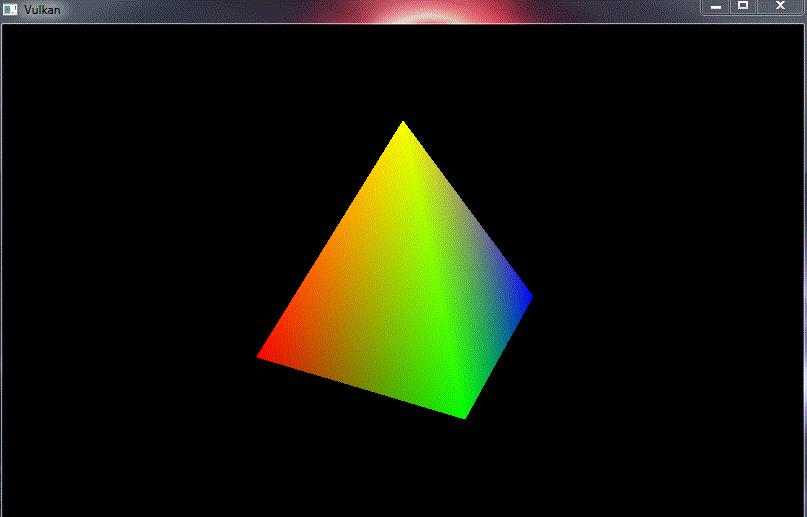

# vulkan-pyramid
This project sets up Vulkan and uses it to render a simple rotating pyramid via index buffered draws.

Also supports resizing the window (which means rebuilding various bits of the Vulkan workflow).

The vertex and fragment shaders provided just pass the vertex attribute colours and positions.

